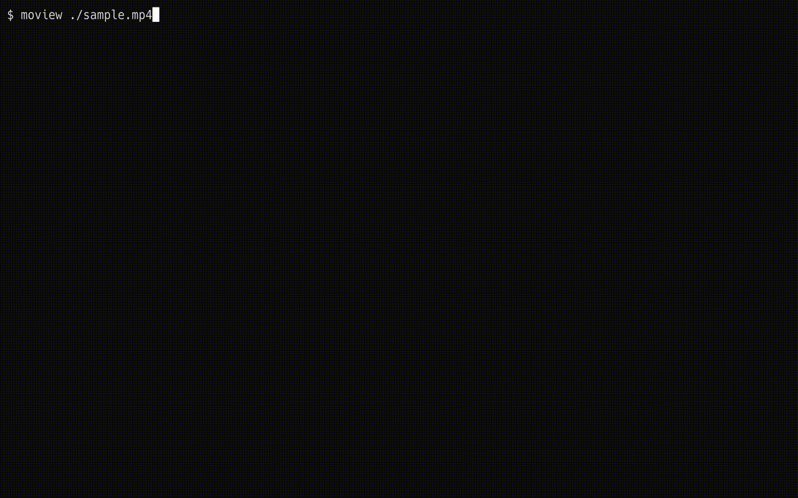

<h1 align="center">moview</h1>

<p align="center">
<a href="https://github.com/koki-develop/moview/releases/latest"></a>
<a href="https://github.com/koki-develop/moview/actions/workflows/ci.yml"></a>
<a href="https://goreportcard.com/report/github.com/koki-develop/moview"></a>
<a href="./LICENSE"></a>
</p>

<p align="center">
Play video in terminal.
</p>

<p align="center">

</p>

## Contents

- [Contents](#contents)
- [Prerequisites](#prerequisites)
- [Installation](#installation)
  - [Homebrew Tap](#homebrew-tap)
  - [`go install`](#go-install)
  - [Releases](#releases)
- [Usage](#usage)
- [LICENSE](#license)

## Prerequisites

moview requires FFmpeg to be installed.
For example, if you want to install it using Homebrew, run the following command:

```console
$ brew install ffmpeg
```

For more information, please refer to the [FFmpeg official site](https://ffmpeg.org).

## Installation

### Homebrew Tap

```console
$ brew install koki-develop/tap/moview
```

### `go install`

```console
$ go install github.com/koki-develop/moview@latest
```

### Releases

Download the binary from the [releases page](https://github.com/koki-develop/moview/releases/latest).

## Usage

```console
$ moview --help
Play video in terminal.

Usage:
  moview FILE [flags]

Flags:
      --auto-play     auto play video
      --auto-repeat   auto repeat video
  -h, --help          help for moview
  -v, --version       version for moview
```

## LICENSE

[MIT](./LICENSE)
